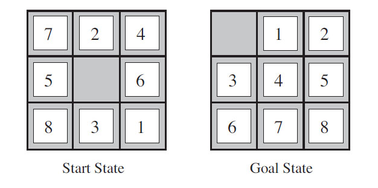

# n-Puzzle solver
Artificial Intelligence, n-Puzzle problem solver, approach: bidirectional BFS

**Figure 1** - Example of an n-Puzzle, image from the book 'Artificial Intelligence: A Modern Approach'

## Requirements:
- [.NET Core runtime](https://dotnet.microsoft.com/download)

## Instructions:
1. Clone the repository
2. Run Terminal/Console in the root directory of the project
3. Type in 'dotnet run'
4. It's up and running
